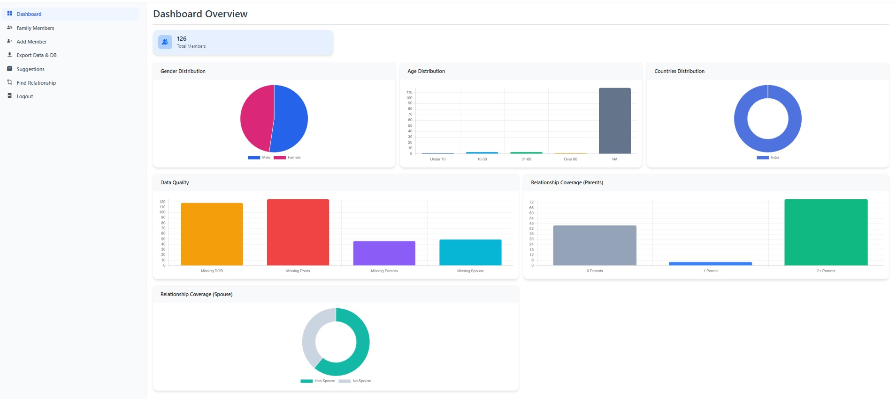
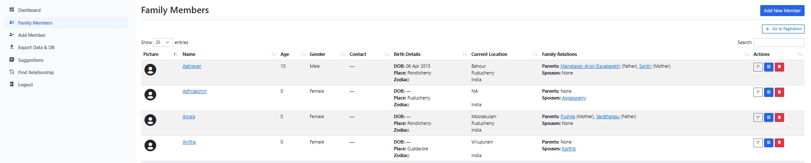
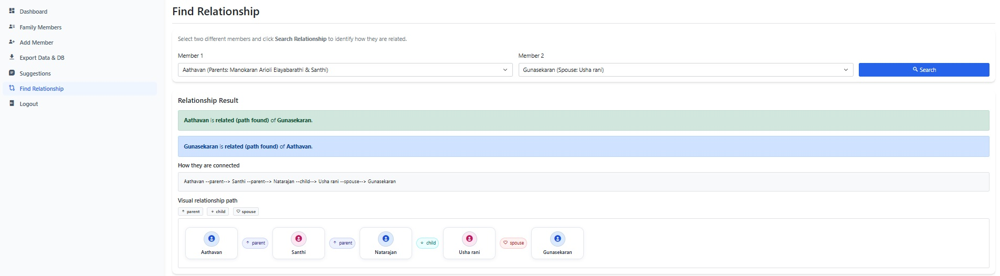

# Family Tree Management System (PHP + MySQL)

A web-based Family Tree Management System with an admin panel to manage members, parent/spouse relationships, interactive family hierarchy view, analytics dashboard, backup/export, and feature suggestion tracking.

## Brief Summary

This project helps families digitally manage member profiles and relationships (parents, spouses, children) with a visual tree view and admin tools. It includes CRUD operations for members, dashboard charts, image upload support, location data handling (country/state), backup/export utilities, and an internal suggestion board for continuous improvements.

---

## Screenshots

> Screenshots are stored in the `reference/` folder.  
> If your file names are different, just update the 3 paths below.

### 1) Dashboard Overview



### 2) Family Members / Tree Management



### 3) Find Relationship Feature



---

## Core Features

### 1) Admin Authentication
- Admin login (`admin/login.php`)
- Session-based access control for all admin pages
- "Remember username and password" option (cookie-based)

### 2) Dashboard & Analytics
- Dashboard overview (`admin/index.php`)
- Total members card
- Gender distribution chart (Male/Female color-coded)
- Age distribution chart with categories:
  - Under 10
  - 10-30
  - 31-60
  - Over 60
  - NA (DOB not updated)
- Country distribution chart
- Clickable charts that open filtered member lists

### 3) Family Members Management (CRUD)
- Members list page (`admin/members.php`)
- Add member (`admin/add_member.php`)
- Edit member (`admin/edit_member.php`)
- Delete member
- Profile image upload and update
- Robust upload handling with folder checks and safe fallbacks

### 4) Relationship Management
- Parent relationship mapping (`member_parents`)
- Spouse relationship mapping (`member_spouses`)
- Support for multiple parent relationship types:
  - Father / Mother
  - Step-Father / Step-Mother
  - Adoptive Father / Adoptive Mother
- Spouse status support:
  - Current / Divorced / Deceased

### 5) Family Tree Visualization
- Tree view page (`admin/member_details.php`)
- Multi-level hierarchy:
  - Parents
  - Current generation
  - Children
  - Grandchildren
- Gender-based name coloring:
  - Male = Blue
  - Female = Pink
- Default gender avatars when photo is missing
- Click profile photo to open large preview lightbox

### 6) Location Enhancements
- Country and state tables added (`countries`, `states`)
- Country dropdown in Add/Edit Member pages
- Dynamic state loading via API (`admin/get_states.php`)
- India states dropdown support
- "Other country" manual input support

### 7) Backup / Export
- Export page (`admin/export.php`)
- Creates timestamped backup folders
- Includes:
  - Admin/config/uploads files
  - Database schema + data
- Backup listing with:
  - SQL download
  - ZIP download
  - Delete backup

### 8) Suggestions / Improvement Board (CRUD)
- Suggestions list (`admin/suggestions.php`)
- Add suggestion (`admin/add_suggestion.php`)
- Edit suggestion (`admin/edit_suggestion.php`)
- Delete suggestion
- Track status: Pending / In Progress / Implemented / Rejected

---

## Tech Stack

- **Backend:** PHP (PDO)
- **Database:** MySQL
- **Frontend:** HTML, Bootstrap 5, JavaScript, jQuery
- **Charts:** Chart.js
- **Icons:** Boxicons
- **Data Table:** DataTables (members listing)

---

## Project Structure

```text
familytree/
├─ admin/
│  ├─ login.php
│  ├─ index.php
│  ├─ members.php
│  ├─ add_member.php
│  ├─ edit_member.php
│  ├─ member_details.php
│  ├─ suggestions.php
│  ├─ add_suggestion.php
│  ├─ edit_suggestion.php
│  ├─ export.php
│  ├─ download_backup.php
│  ├─ get_states.php
│  ├─ logout.php
│  └─ includes/sidebar.php
├─ config/
│  └─ database.php
├─ reference/
│  ├─ dashboard-overview.png
│  ├─ family-members-tree.png
│  └─ find-relationship.png
├─ sql/
│  ├─ add_admin_suggestions_table.sql
│  └─ add_countries_states_tables.sql
├─ database.sql
└─ index.php
```

---

## Database Overview

Main tables:

- `admins` - admin login users
- `family_members` - member profile master data
- `member_parents` - parent mapping
- `member_spouses` - spouse mapping
- `countries` - country master
- `states` - state master
- `admin_suggestions` - internal feature/suggestion tracker

> Full schema is available in `database.sql`.

---

## Setup Instructions

### Prerequisites
- PHP 8.x
- MySQL 8.x
- Apache (WAMP/XAMPP/LAMP)

### 1) Clone / Copy project

Place project in your web root (example):

```bash
c:\wamp64\www\familytree
```

### 2) Create Database

Create a database named `familytree_db` and import:

- `database.sql` (full setup), or
- Run incremental scripts from `sql/` if upgrading existing DB.

### 3) Configure DB connection

Update `config/database.php` if needed:

```php
define('DB_HOST', 'localhost');
define('DB_NAME', 'familytree_db');
define('DB_USER', 'root');
define('DB_PASS', '');
```

### 4) Ensure upload folder exists

Create and allow write access:

```text
familytree/uploads/
```

### 5) Run application

Open in browser:

```text
http://localhost/familytree/admin/login.php
```

Default admin from seed data:

- Username: `admin`
- Password: `password`

---

## Usage Flow

1. Login as admin  
2. Add/Edit members with profile details, DOB, and photos  
3. Set parent/spouse relationships  
4. Open member tree view for hierarchy  
5. Use dashboard charts to analyze and filter records  
6. Track missing DOB through `NA` age category  
7. Create backups from Export page  
8. Record enhancement ideas in Suggestions page

---

## Important Notes

- The current login implementation uses plain password comparison from DB seed data.
- For public production usage, migrate to secure password hashing (`password_hash` / `password_verify`) and hardened auth practices.
- Engine in schema is currently `MyISAM`; consider `InnoDB` for FK constraints and transactional integrity.

---

## Future Enhancements (Recommended)

- Secure authentication with hashed passwords and reset flow
- Role-based access control (multiple admin roles)
- Better media management (thumbnail generation, file size controls)
- Member import/export (CSV/Excel)
- Tree rendering performance optimization for very large families
- Activity logs / audit trail

---

## License

Add your preferred license here before publishing (e.g., MIT).

---

## Author / Maintainer

Update this section with your name, contact, and project links before making the repository public.

